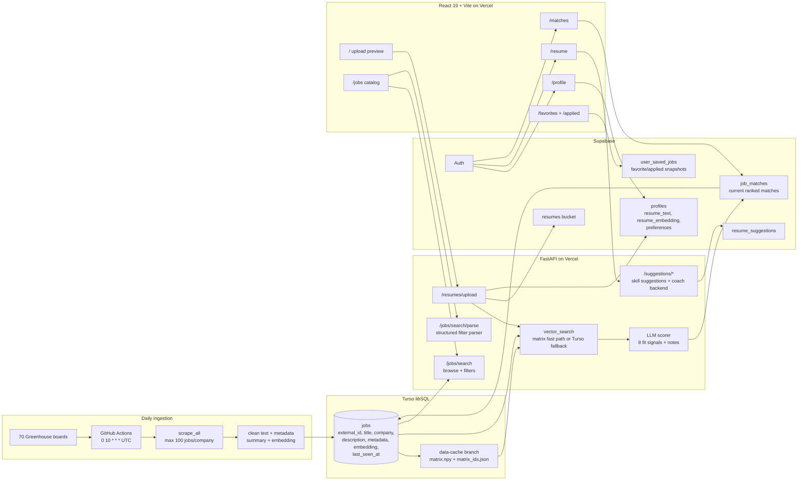

# MatchPoint architecture

This file describes the implemented production architecture in the `matchpoint` repo as of 2026-07-10.

## System diagram

## Frontend routes

| Route | Auth required | Purpose |
|---|---:|---|
| `/` | No | Landing page with PDF upload. Anonymous visitors receive a 3-job preview and signup prompt. |
| `/jobs` | No | Browse/search the full job catalog with structured filters and natural-language filter extraction. |
| `/matches` | Mixed | Anonymous visitors can see upload-preview matches from route state; signed-in users load persisted matches. |
| `/profile` | Yes | Update email and matching preferences: target role, locations, work modes, minimum salary. |
| `/resume` | Yes | View, upload/re-upload/delete resume; load or generate grounded resume suggestions. |
| `/favorites` | Yes | Show favorited jobs, using durable saved-job rows when available. |
| `/applied` | Yes | Show jobs marked applied, using durable saved-job rows when available. |

Protected routes use Supabase auth in the React app. Backend protected endpoints verify the `Authorization: Bearer <token>` header with `supabase.auth.get_user`.

## Resume upload request path

### Anonymous visitor

1. User uploads a PDF to `POST /resumes/upload`.
2. FastAPI checks `content_type == application/pdf`.
3. `pypdf` extracts resume text.
4. `generateEmbedding` embeds the extracted text with `text-embedding-3-small`.
5. `score_job_matches` retrieves 3 vector candidates, fetches full Turso job rows, extracts job facts, scores them with the LLM scorer, sorts by weighted `match_score`, and returns 3 preview jobs.
6. No resume file, profile row, or match rows are persisted for the visitor.

### Authenticated user

1. User uploads a PDF to `POST /resumes/upload` with a valid bearer token.
2. The PDF is stored in Supabase Storage at `{user_id}/resume.pdf`.
3. Extracted text and a resume embedding are written to `profiles.resume_text` and `profiles.resume_embedding`.
4. The backend fetches profile preferences and builds match-query text by prepending explicit preferences to the resume text.
5. The combined query text is embedded.
6. `score_job_matches` retrieves 10 vector candidates, scores them with the LLM, and sorts them by final score.
7. `_persist_job_matches` calls the Supabase `replace_job_matches` RPC, which deletes the user's current `job_matches` rows and inserts the new scored set.
8. The response returns the newly scored jobs; the frontend navigates to `/matches`.

## Recalculation path

`POST /matches/recalculate` reuses stored `profiles.resume_text` plus current profile preferences. It does not require a new upload. It follows the same embedding, retrieval, scoring, and `replace_job_matches` persistence path as authenticated upload.

Important: daily job ingestion refreshes the job corpus, but the code does not show an automatic scheduled per-user match recalculation. User match recalculation happens on resume upload or explicit `/matches/recalculate`.

## Vector retrieval

The vector path is implemented in `backend/app/db/turso.py` and `backend/app/services/embedding_matrix.py`.

- Embedding model: `text-embedding-3-small`.
- Embedding dimension: 1536.
- Matrix artifact: `data/embeddings/matrix.npy` plus `data/embeddings/matrix_ids.json`.
- Artifact branch: `data-cache`, force-pushed by the daily pipeline as a single-current-state branch.
- Production default source: `EMBEDDINGS_SOURCE=github`.
- Fast path: resolve the latest `data-cache` commit through the GitHub API, fetch raw matrix files by commit SHA, validate shape/dtype/id alignment, cache them in process, normalize the query vector, and compute cosine scores with matrix multiplication.
- Fallback path: if the matrix is disabled, missing, invalid, or cannot be loaded, scan Turso rows with non-null embedding JSON and compute cosine similarity in Python.

The matrix is an optimization only. The request path is designed to remain correct if the matrix cannot load.

## LLM scorer

The scorer is implemented in `backend/app/services/ranking.py`.

- Default model: `OPENAI_SCORING_MODEL`, default value `gpt-5.4-nano`.
- Timeout: `OPENAI_SCORING_TIMEOUT_SECONDS`, default 75 seconds.
- Batch size: `SCORING_BATCH_SIZE`, default 5.
- Parallelism: `SCORING_PARALLELISM`, default 2.
- Resume prompt cap: `SCORING_RESUME_CHAR_LIMIT`, default 6000 chars.
- Job description cap: `SCORING_JOB_DESCRIPTION_CHAR_LIMIT`, default 1000 chars.
- Structured response model: `ScoringResponse` with one `JobScore` per input job.

The scorer must return exactly one score per requested job ID. Validation rejects missing, duplicated, or extra IDs. If validation fails, the service retries with a correction. If batch scoring still fails, the code falls back to per-job requests.

Each `JobScore` contains:

- `interview_likelihood`
- `skills_fit`
- `experience_fit`
- `seniority_fit`
- `location_fit`
- `pay_fit`
- `role_fit`
- `preference_fit`
- `match_notes`

`match_notes` must include exactly three regular notes. Warning notes are optional. `normalize_match_notes` promotes drawback language into warnings and backfills regular notes so each job still has three positive/balanced notes.

## Job facts and preference handling

Before LLM scoring, the API extracts structured facts from each job:

- Work modes from text markers such as remote, hybrid, on-site, onsite, and in-office.
- Locations from resolved Greenhouse location text and city/state patterns in descriptions.
- Salary ranges from explicit pay/salary/compensation sentences or dollar ranges.
- Role family from title markers such as software engineering, data, product, design, sales, marketing, security, and finance.

Profile preferences are only used when explicitly saved by the user. The scorer is instructed not to invent location, pay, role, or work-mode preferences from the resume unless they are present in `USER_PREFERENCES`.

## Job catalog search

`GET /jobs/search` queries Turso directly and returns browse listings plus total count.

Supported filters:

- `q`: keyword terms across title, company, and description.
- `location`: comma-separated location filters.
- `level`: experience levels: internship, entry, mid, senior, lead, executive.
- `type`: job types: full_time, part_time, contract, internship, temporary.
- `workplace`: remote, hybrid, on_site.
- `pay_min` and `pay_max`.
- `posted`: any, 24h, 3d, 7d, 14d, 30d.
- `sort`: relevance or newest.
- `page`, `page_size`.

Search uses SQL `LIKE` filters and derived metadata columns. When metadata columns are null, filter helpers fall back to title/location/description pattern matching. Relevance sorting weights title matches higher than company matches, and company matches higher than description matches.

`POST /jobs/search/parse` uses structured LLM output to parse natural language into the same filter shape. It only returns filters explicitly implied by the user's message.

Browse listings are enriched on first display:

- Missing metadata is derived from job text and persisted to Turso.
- Missing summaries are generated with `OPENAI_SUMMARY_MODEL`, default `gpt-5.4-nano`, for at most `OPENAI_SUMMARY_MAX_PER_REQUEST` jobs per request. Extra jobs receive an in-memory text excerpt fallback.

## Saved and applied jobs

There are two layers:

- Current match flags live on `job_matches`: `is_viewed`, `is_favorited`, `is_applied`.
- Durable favorite/applied tracking can live in `user_saved_jobs`. When configured, toggling favorite/applied upserts a row keyed by `(user_id, job_id)` with job and match snapshots. If both favorite and applied become false, the saved row is deleted.

When fetching `/matches/me?favorited=true` or `/matches/me?applied=true`, the route combines durable saved rows with current match rows and de-duplicates by job ID. This lets favorite/applied pages show saved jobs even if the current match list has since been replaced.

## Deletion and orphan handling

- `DELETE /matches/{match_id}` deletes one current match row owned by the user.
- When fetching current matches, the API first reads Supabase `job_matches`, then hydrates Turso job details by job ID.
- If a match references a job no longer present in Turso, the API skips that match and best-effort deletes the orphaned `job_matches` row for that user.

## Resume suggestions architecture

Suggestion endpoints use the current stored resume plus top current matches:

- Top evidence window: 20 matches.
- Suggestion model: `OPENAI_SUGGESTIONS_MODEL`, default `gpt-4o-mini`.
- Suggestions are cached in Supabase `resume_suggestions` using a SHA-256 cache key built from resume text plus sorted top-job IDs.
- A refresh always makes a new LLM call, persists the resulting suggestions, and prunes old history above 50 rows per user.

Validation is strict:

- Every citation quote must be a verbatim substring of the cited job description after whitespace normalization.
- Single-job suggestions must share a token with the citation quote.
- Multi-job suggestions can survive through prevalence.
- Duplicates and banned broad categories are dropped.
- Learning links are resolved server-side from a curated lookup; the LLM should not invent them.

## Bullet coach backend

The bullet coach is implemented but currently hidden in the frontend.

- `POST /suggestions/coach/start` returns a `session_id`, skill suggestions, and up to 4 weak resume bullets with targeted questions.
- Sessions live in an in-memory Python dictionary with a 1-hour idle TTL. They are not multi-process safe and are lost on server restart.
- `POST /suggestions/coach/rewrite` uses the original bullet, user answers, and a cited job quote to generate one rewritten bullet.
- The rewrite response is validated so numbers, named entities, technologies, and other factual claims must be grounded in the original bullet, the user's answers, or the cited job quote.

Frontend caveat: the current React component comments say the coach button and rewrite input UI are temporarily hidden because `/coach/rewrite` can hang on some OpenAI calls. Assistants should not tell users the visible UI currently supports interactive bullet rewrites.

## Operational notes

- CORS allows local Vite dev origins and the configured `FRONTEND_URL`.
- Backend Vercel rewrites all routes to `/api/index`.
- Frontend Vercel rewrites all routes to `/index.html`.
- The job corpus is refreshed by GitHub Actions. User state is not touched by that pipeline.
- The `data-cache` branch should be treated as pipeline-owned. It is force-pushed with lease to avoid storing daily 33 MB binary artifacts in normal branch history.
