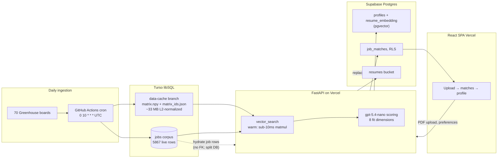

# MatchPoint — architecture overview

Production data path as implemented in the matchpoint repo (July 2026).

## System diagram

## Request path (resume → ranked matches)

1. **Upload** — React SPA posts a PDF to `POST /resumes/upload`.
2. **Parse** — FastAPI extracts text with **pypdf**, embeds via OpenAI `text-embedding-3-small` (1536-d).
3. **Retrieve** — `vector_search` loads the precomputed NumPy matrix from the **`data-cache`** git branch (fallback: Turso row scan). Returns top **10** candidates (**3** for anonymous visitors).
4. **Score** — **`gpt-5.4-nano`** returns structured fit signals across eight weighted dimensions plus exactly three grounded highlights and optional warnings.
5. **Persist** (authenticated) — resume file to Supabase Storage; embedding on `profiles.resume_embedding`; matches via **`replace_job_matches`** RPC into `job_matches`.
6. **Render** — SPA lists ranked cards with match %, fit badges, highlights, and warnings.

## Split-database design

| Store | Holds | Why |
|-------|-------|-----|
| **Turso** | Job corpus, embeddings JSON, `last_seen_at` | Cheap libSQL at scale; daily pipeline write path |
| **Supabase** | Auth, profiles, preferences, matches, resume storage | RLS, pgvector on profiles, team-standard auth |

The `job_matches.job_id → jobs.id` Postgres FK was **dropped intentionally** once jobs moved to Turso. Match rows store Turso UUIDs; the API hydrates job details from Turso at read time.

## Freshness and cache

- Pipeline scrapes up to **100 jobs per board**, purges rows not seen in **7 days**.
- Embedding matrix is **force-pushed** to `data-cache` (single-commit branch) so Vercel serverless can warm-load ~33 MB once per instance for fast cosine search.

## Notes for assistants

- For product summary and fit-dimension weights, see `docs/project-knowledge/matchpoint/overview.md`.
- MatchPoint uses its **own Supabase project**, not the shared sports-edge/llm-advisor serving layer.
